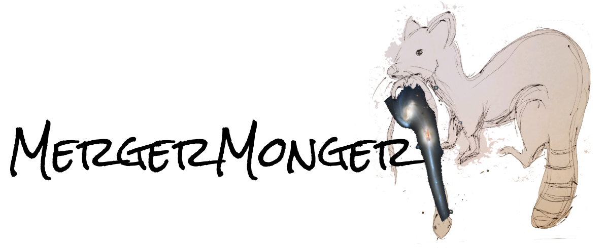

# Purpose

The purpose of this package is to identify merging galaxies from observational samples. It is highly adaptable and has functionality on both IFS (kinematic) surveys as well as imaging surveys. It also is adaptable in that it is possible to redo the classification directly from a set of simulated galaxies provided here.